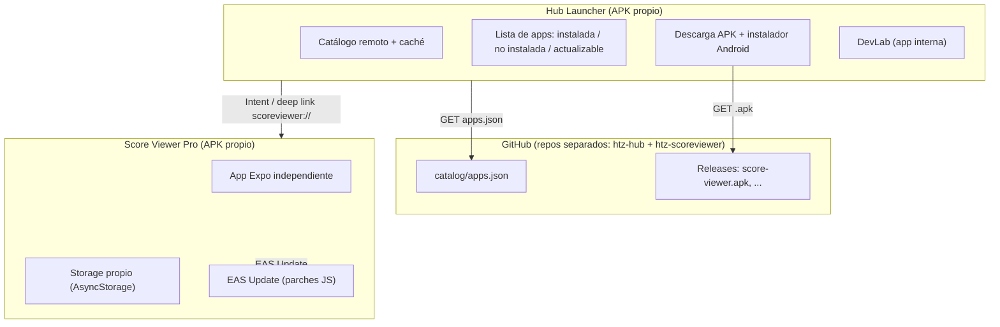

# Plan: Hub como Launcher + Apps independientes descargables

> Documento de diseño previo al desarrollo. Objetivo: convertir el ecosistema actual
> (una sola app Expo que contiene sub-apps en proceso) en un modelo donde cada app es
> **una app Android independiente y descargable**, y el Hub funciona como **launcher /
> tienda de apps personal**.

---

## 1. Decisiones ya tomadas

| Decisión | Elección |
| --- | --- |
| Plataforma | **Solo Android** (iOS queda fuera del flujo de instalación) |
| Descarga desde el Hub | **Descargar e instalar el APK dentro del Hub** |
| Hosting de catálogo y binarios | **GitHub Releases + catálogo JSON en el repo** |
| Apps internas actuales | **Score Viewer se externaliza; DevLab & Tools sigue integrado en el Hub** |

---

## 2. Diagnóstico del estado actual

Hoy `hub-app` es un **monolito**: las "apps" no son apps, son componentes React que el Hub
renderiza en su propio proceso.

```
hub-app/
├── App.tsx                         → HubNavigation (tabs) o SubAppContainer
├── src/
│   ├── apps/
│   │   ├── registry.ts             → INTEGRATED_APPS: [ScoreViewer, DemoTool]
│   │   ├── score-viewer/           → 32 archivos, ~680 KB de código
│   │   │   ├── manifest.ts         → rootComponent: ScoreViewerApp
│   │   │   └── ScoreViewerApp.tsx  → recibe { appId, onExitToHub, storage }
│   │   └── demo-tool/
│   ├── components/
│   │   ├── SubAppContainer.tsx     → inyecta storage y monta rootComponent
│   │   └── htz/                    → design system compartido
│   ├── context/HubContext.tsx      → launchApp() cambia activeAppId
│   ├── storage/hubStorage.ts       → AsyncStorage con prefijo @app_<id>_
│   └── types/index.ts              → IntegratedAppManifest, SubAppProps
```

**Acoplamientos de `score-viewer` con el Hub:**
- `../../types` → `SubAppProps`, `IntegratedAppManifest`.
- `../../components/htz` → design system (importado en ~22 archivos).
- La prop `storage` inyectada por `SubAppContainer`.
- `onExitToHub` (botón de volver al Hub).
- `tournamentService.ts` usa `AsyncStorage` directamente (se salta el aislamiento).

**Consecuencia:** para que la app sea descargable y usable sin Hub hay que **extraerla** y
**eliminar esos acoplamientos**. No es solo un cambio de UI.

---

## 3. Arquitectura objetivo



**Principio clave:** el único punto de integración entre el Hub y las apps es el
**catálogo**. Cada app se compila, firma y publica por separado.

---

## 4. Estructura de repositorios

**Decisión (actualizada):** repos separados por proyecto, con identidad `htz`. El Hub aloja
el catálogo; cada app publica sus Releases en su propio repo.

| Repo GitHub | Contenido local | Rol |
| --- | --- | --- |
| `haritzeizagirre/htz-hub` | `C:\VSCode\score_viewer\hub-app` | Launcher + `catalog/apps.json` |
| `haritzeizagirre/htz-scoreviewer` | `C:\VSCode\score_viewer\apps\score-viewer` | App independiente Score Viewer |
| `haritzeizagirre/htz-gtr3-tracker` | `C:\VSCode\score_viewer\score-tracker-gtr3` | Mini-app del Amazfit GTR 3 |

Cada carpeta es su **propio repositorio git** (la raíz `score_viewer` no es repo, es solo el
espacio de trabajo). Ventajas: EAS funciona por proyecto sin configurar monorepo, y cada app
tiene su keystore y sus Releases independientes.

```
C:\VSCode\score_viewer\            # workspace (no es repo)
├── hub-app\                       # repo htz-hub
│   ├── catalog\apps.json          # catálogo publicado (fuente de verdad)
│   ├── scripts\publish-app.mjs    # build + release + actualizar catálogo
│   └── docs\PLAN_LAUNCHER.md      # este documento
├── apps\score-viewer\             # repo htz-scoreviewer
│   ├── app.json                   # package com.haritz.scoreviewer, scheme scoreviewer
│   ├── eas.json
│   ├── App.tsx
│   └── src\ { ScoreViewerApp, components\htz, services, storage }
└── score-tracker-gtr3\            # repo htz-gtr3-tracker
```

> **Sobre `htz`:** para la Fase 1 se **copia** `htz` dentro de la app para que sea 100 %
> autocontenida (sin symlinks, builds EAS simples). En una fase posterior se puede extraer a
> un paquete compartido `@htz/ui` si se prevén más apps.

---

## 5. El catálogo de apps (contrato Hub ↔ apps)

`catalog/apps.json` vive en el repo del Hub y se sirve como JSON estático
(`https://raw.githubusercontent.com/haritzeizagirre/htz-hub/main/catalog/apps.json`).
El Hub incluye además una **copia embebida de respaldo** para funcionar sin red.

```jsonc
{
  "schemaVersion": 1,
  "updatedAt": "2026-10-06T12:00:00Z",
  "apps": [
    {
      "id": "score-viewer",
      "name": "Score Viewer Pro",
      "subtitle": "Marcadores en vivo & Companion GTR 3",
      "description": "Visualizador de resultados deportivos y esports en tiempo real...",
      "icon": "Trophy",              // clave de icono Lucide (fallback)
      "accentColor": "#10B981",
      "category": "deportes",
      "badge": "PRINCIPAL",
      "latest": {
        "version": "2.1.0",          // versionName de Android
        "versionCode": 3,            // debe subir en cada APK nuevo
        "publishedAt": "2026-10-06T12:00:00Z",
        "apkUrl": "https://github.com/<usuario>/<repo>/releases/download/score-viewer-v2.1.0/score-viewer.apk",
        "size": 52428800,
        "sha256": "…",               // verificación de integridad
        "minHubVersion": "1.1.0",
        "changelog": ["Añadido R6", "Fix caché"]
      },
      "android": {
        "package": "com.haritz.scoreviewer",
        "scheme": "scoreviewer"
      }
    }
  ]
}
```

**Tipo TypeScript equivalente** (en `hub-app/src/types`):

```ts
export interface CatalogAppRelease {
  version: string;
  versionCode: number;
  publishedAt: string;
  apkUrl: string;
  size?: number;
  sha256?: string;
  minHubVersion?: string;
  changelog?: string[];
}

export interface CatalogApp {
  id: string;
  name: string;
  subtitle: string;
  description: string;
  icon: string;
  accentColor: string;
  category: Exclude<AppCategory, 'todas'>;
  badge?: string;
  latest: CatalogAppRelease;
  android: { package: string; scheme: string };
}

export interface AppCatalog {
  schemaVersion: number;
  updatedAt: string;
  apps: CatalogApp[];
}
```

---

## 6. Score Viewer Pro como app independiente

### 6.1 Extracción
1. Crear `apps/score-viewer/` con el esqueleto de un proyecto Expo (`package.json`,
   `app.json`, `eas.json`, `tsconfig.json`, `App.tsx`).
2. Mover `hub-app/src/apps/score-viewer/**` → `apps/score-viewer/src/**`.
3. Copiar `hub-app/src/components/htz/**` → `apps/score-viewer/src/components/htz/**`
   y reescribir los imports (`../../../components/htz` → `../../components/htz`).
4. Añadir dependencias equivalentes: `expo`, `react`, `react-native`,
   `react-native-safe-area-context`, `react-native-svg`, `lucide-react-native`,
   `@react-native-async-storage/async-storage`, `expo-status-bar`.
5. Borrar de `hub-app` la carpeta `src/apps/score-viewer` y su entrada en `registry.ts`.

### 6.2 Adaptar la entrada (`SubAppProps` → app real)
`ScoreViewerApp` deja de recibir `storage`/`onExitToHub` inyectados. Se crea un
adaptador local:

```ts
// apps/score-viewer/src/storage/appStorage.ts
import AsyncStorage from '@react-native-async-storage/async-storage';
import type { SubAppStorage } from '../types';

const PREFIX = '@score_viewer_';

export const AppStorage: SubAppStorage = {
  async get(key, defaultValue) { /* AsyncStorage.getItem(PREFIX+key) + JSON.parse */ },
  async set(key, value) { /* AsyncStorage.setItem(PREFIX+key, ...) */ },
  async remove(key) { /* ... */ },
  async clear() { /* borra claves con PREFIX */ },
};
```

```tsx
// apps/score-viewer/App.tsx
import { ScoreViewerApp } from './src/ScoreViewerApp';
export default function App() {
  return <ScoreViewerApp storage={AppStorage} onExitToHub={() => BackHandler.exitApp()} />;
}
```

El botón superior izquierdo "volver al Hub" pasa a ser **"Salir"** (o se oculta), porque
la app ya es autónoma. `tournamentService.ts` puede seguir usando `AsyncStorage`
directamente (ya está aislado por ser otra app).

### 6.3 `app.json` de la app
```jsonc
{
  "expo": {
    "name": "Score Viewer Pro",
    "slug": "score-viewer",
    "version": "2.1.0",
    "scheme": "scoreviewer",
    "orientation": "portrait",
    "android": {
      "package": "com.haritz.scoreviewer",
      "versionCode": 3,
      "adaptiveIcon": { "backgroundColor": "#1E2420", "foregroundImage": "./assets/icon.png" }
    },
    "runtimeVersion": { "policy": "appVersion" },
    "updates": { "url": "https://u.expo.dev/<projectId>" },
    "extra": { "eas": { "projectId": "<projectId>" } }
  }
}
```

### 6.4 Migración de datos (aviso importante)
Al separar la app, su `AsyncStorage` es nuevo y **empieza vacío**: se pierden
`watch_config`, favoritos, torneos, etc. que hoy viven en el Hub bajo
`@app_score-viewer_*`. Mitigaciones:
- Usar el **export/import JSON** que ya existe en Ajustes del Hub.
- Añadir en la app un botón "Importar backup" que lea el JSON exportado.
- (Opcional) Un modo "migración" que lea el backup del Hub una sola vez.

---

## 7. El Hub como launcher

### 7.1 Refactor del registro
- `INTEGRATED_APPS` se queda solo con **DevLab** (app interna, `rootComponent`).
- Nuevo módulo `catalogService.ts`: descarga el catálogo remoto, lo cachea en
  AsyncStorage y hace fallback a la copia embebida.
- La pantalla principal muestra **dos fuentes** unificadas: apps internas + apps del
  catálogo. Cada tarjeta calcula su **estado**.

### 7.2 Estados de una app externa

| Estado | Condición | Acción de la tarjeta |
| --- | --- | --- |
| `not-installed` | paquete no presente | Icono **⬇ Descargar** |
| `installed` | paquete presente y versión registrada == catálogo | **Abrir** |
| `update-available` | instalada y versión registrada != catálogo | **Actualizar** |
| `installing` | descarga/instalación en curso | Spinner + progreso |
| `incompatible` | `minHubVersion` > versión del Hub | Aviso, descarga deshabilitada |

### 7.3 Detección de app instalada (Android)
- Usar `IntentLauncher.getApplicationIconAsync(packageName)`:
  devuelve un `data:image/png;base64,...` con el icono real, o `""` si no está
  instalada / no es visible. Sirve a la vez para **detectar** y para **mostrar el icono**.
- Requiere visibilidad de paquetes. Añadir en `hub-app/app.json`:
  ```jsonc
  "android": { "permissions": ["REQUEST_INSTALL_PACKAGES", "QUERY_ALL_PACKAGES"] }
  ```
  `QUERY_ALL_PACKAGES` evita tener que reconstruir el Hub cada vez que se añade una app
  nueva al catálogo (relevante porque el catálogo es dinámico). Para un APK personal
  sideloaded es perfectamente válido.

### 7.4 Descarga e instalación del APK
```ts
import { File, Paths } from 'expo-file-system';
import * as IntentLauncher from 'expo-intent-launcher';
import * as Application from 'expo-application';

async function installApk(app: CatalogApp) {
  // 1) Permiso para instalar apps desconocidas (solo la primera vez)
  await IntentLauncher.startActivityAsync(
    IntentLauncher.ActivityAction.MANAGE_UNKNOWN_APP_SOURCES,
    { data: `package:${Application.applicationId}` },
  );

  // 2) Descargar el APK a caché
  const dest = new File(Paths.cache, `${app.id}-${app.latest.version}.apk`);
  if (dest.exists) dest.delete();
  const file = await File.downloadFileAsync(app.latest.apkUrl, dest);

  // 3) Lanzar el instalador del sistema
  await IntentLauncher.startActivityAsync('android.intent.action.VIEW', {
    data: file.contentUri,                       // content:// URI (Android)
    type: 'application/vnd.android.package-archive',
    flags: 1,                                    // FLAG_GRANT_READ_URI_PERMISSION
  });

  // 4) Al volver, re-detectar y, si está instalada, guardar versión
  await markInstalled(app.id, app.latest.version);
}
```

Notas:
- `File.downloadFileAsync` (API nueva de `expo-file-system` en SDK 57) y
  `File.contentUri` existen y están pensados justo para compartir con apps externas.
- Opcional: verificar `sha256` con `expo-crypto` antes de instalar.
- Android permite **actualizar in-place** si el APK nuevo tiene `versionCode` mayor y
  **la misma firma** (mismo keystore EAS). EAS gestiona esto por proyecto.

### 7.5 Lanzar una app instalada
```ts
IntentLauncher.openApplication(app.android.package); // Android
// alternativa: Linking.openURL('scoreviewer://')
```

### 7.6 Detección de versión instalada
- **Fase 1 (simple y suficiente):** el Hub guarda en AsyncStorage la versión que instaló
  (`installedVersions[appId]`). Si el catálogo trae una versión distinta → "Actualizar".
  Si la app se instaló manualmente fuera del Hub, se asume "instalada" y se ofrece
  "Actualizar" de forma conservadora.
- **Fase 3 (opcional, exacta):** pequeño módulo nativo Expo en el Hub que exponga
  `PackageManager.getPackageInfo(pkg).versionName/versionCode`. Elimina la ambigüedad.

---

## 8. Pipeline de publicación y actualización

### 8.1 Dos tipos de cambio
| Tipo de cambio | Mecanismo | ¿Nuevo APK? | ¿Toca catálogo? |
| --- | --- | --- | --- |
| Solo JS/UI/lógica | `eas update` (OTA) | No | No |
| Nativo (deps, SDK, permisos) | `eas build` → APK | Sí | Sí (nueva versión) |

EAS Update hace que la mayoría de cambios lleguen solos a la app instalada al abrirla,
sin pasar por el Hub. El catálogo/APK solo es necesario para cambios nativos.

### 8.2 Script `scripts/publish-app.mjs`
```
node scripts/publish-app.mjs score-viewer
```
Pasos:
1. Lee `apps/<id>/app.json` → `version`, `android.versionCode`, `android.package`.
2. Ejecuta `eas build -p android --profile production` (perfil APK) y obtiene la ruta del APK.
3. Calcula `size` y `sha256`.
4. `gh release create <id>-v<version> <apk>` (o sube el asset si el release existe).
5. Actualiza `catalog/apps.json`:
   `latest = { version, versionCode, publishedAt, apkUrl, size, sha256, changelog }`.
6. `git add catalog/apps.json && git commit`.

Flujo del usuario tras cambiar una app:
1. `cd apps/score-viewer && npx expo start` para probar.
2. Si es solo JS: `eas update --channel production`.
3. Si es nativo: `node scripts/publish-app.mjs score-viewer`.
4. Al abrir el Hub, este descarga el catálogo nuevo y muestra "Actualizar".

### 8.3 Catálogo remoto
- Fuente: `raw.githubusercontent.com/haritzeizagirre/htz-hub/main/catalog/apps.json`.
- Los APKs se publican como Releases en `haritzeizagirre/htz-scoreviewer` (y los repos de app sucesivos).
- El Hub lo descarga al arrancar, lo cachea y hace merge con la copia embebida.
- ⚠️ **Restricción:** un repo **privado** no sirve `raw.githubusercontent.com` ni los assets de
  Releases por HTTPS anónimo (dan 404). Para que el Hub descargue catálogo/APK, el repo que los
  aloja debe ser **público** (o el Hub necesitaría un token de GitHub).
  Opciones: (a) hacer públicos `htz-hub` y el repo de la app; (b) hacer público solo `htz-hub`
  y publicar allí los APKs, dejando el código de las apps privado.

---

## 9. Fases de implementación

### Fase 0 — Preparación  ✅ (repos creados)
- [x] Crear los repos GitHub (privados por ahora): `htz-hub`, `htz-scoreviewer`,
      `htz-gtr3-tracker`, y subir el proyecto. Los tres en rama `main`.
- [x] Confirmar nombres de paquete: Hub `com.haritz.hubapp` (ya existe),
      Score Viewer `com.haritz.scoreviewer`.
- [x] Seguridad: eliminado el token real de PandaScore hardcodeado en `ScoreViewerApp.tsx`
      y excluido `score-tracker-gtr3/app-side/config.js` (con `.gitignore` +
      `config.example.js`).
- [x] **Incidente de seguridad:** al hacer `htz-hub` público se detectó el token en el
      historial antiguo. Se reescribió el historial y se **borró y recreó** `htz-hub` para
      purgarlo por completo (commit antiguo ahora 404). **Pendiente: rotar el token en
      PandaScore (obligatorio; el valor debe considerarse comprometido).**
- [ ] Decidir si se mantiene el proyecto EAS del Hub y se crea uno nuevo para Score Viewer.
- [ ] Pasar los repos a públicos cuando estén listos.

### Fase 1 — Extraer Score Viewer a app independiente  ✅ (código; falta build/prueba en dispositivo)
- [x] Crear `apps/score-viewer` (Expo + EAS).
- [x] Mover código y `htz`; adaptar imports (`./htz`, `./components/htz`, `./types`).
- [x] Crear `AppStorage` (prefijo `@app_score-viewer_` para facilitar migración) y adaptar `App.tsx`.
- [x] Sustituir "volver al Hub" por "Salir" (`BackHandler.exitApp()`).
- [x] `npx tsc --noEmit` pasa y `npx expo export --platform android` empaqueta (2628 módulos).
      `npx expo lint` reporta 9 errores / 53 avisos **heredados** del código original
      (`react-hooks/set-state-in-effect`, imports sin usar). No afectan al runtime;
      pendiente de limpieza en una tarea aparte.
- [x] APK generado en local (`gradlew assembleRelease`, sin cola de EAS) e instalado/probado
      por el usuario: **funciona sin el Hub**. (La build de EAS quedó en cola; se puede cancelar.)
- [ ] (Opcional) botón "Importar backup".


### Fase 2 — Hub launcher con catálogo local  ✅
- [x] Definir tipos `CatalogApp` / `AppCatalog` (y `LauncherApp` unificado).
- [x] Crear `catalog/apps.json` con Score Viewer.
- [x] Catálogo embebido (import JSON) + `CatalogService` con caché y fetch remoto.
- [x] Refactor `registry.ts` para unificar apps internas (DevLab) + externas (catálogo).
- [x] Tarjeta con estados (Descargar / Abrir / Actualizar / Instalando / No compatible).
- [x] Quitar `score-viewer` del Hub.

### Fase 3 — Descarga, instalación y lanzamiento (Android)  ✅ (código; falta probar en dispositivo)
- [x] Añadir `expo-file-system`, `expo-intent-launcher`, `expo-application`, `expo-crypto`.
- [x] Permisos `REQUEST_INSTALL_PACKAGES` y `QUERY_ALL_PACKAGES` en `hub-app/app.json`.
- [x] Servicio `launcherService.ts`: permiso → descarga → instalador (`content://` + MIME APK).
- [x] Detección con `getApplicationIconAsync`; icono real en la tarjeta.
- [x] Lanzar con `openApplication` (fallback a deep link `scheme://`).
- [x] Registrar versión instalada y calcular "Actualizar".
- [ ] Probar en dispositivo real (requiere rebuild nativo del Hub; en curso).

### Fase 4 — Publicación y catálogo remoto
- [ ] `scripts/publish-app.mjs` (build + release + catálogo).
- [ ] Fetch remoto del catálogo + caché + fallback embebido.
- [ ] Flujo completo: cambio nativo → publish → Hub muestra "Actualizar" → instala.
- [ ] (Opcional) GitHub Actions para automatizar el publish.

### Fase 5 — Extras
- [ ] `expo-updates` en Score Viewer para parches OTA.
- [ ] Módulo nativo de versión exacta (Fase 7.6 opcional).
- [ ] Extraer `@htz/ui` como paquete compartido (monorepo) si se prevén más apps.
- [ ] Desinstalar apps desde el Hub (`ACTION_DELETE`).
- [ ] Firma/verificación del catálogo (opcional, para más seguridad).

---

## 10. Riesgos y limitaciones

1. **iOS no soporta instalar apps desde otra app.** Por eso el plan es Android-only.
   Si algún día se quiere iOS, el Hub solo podrá abrir enlaces de App Store/TestFlight.
2. **Permiso de instalación:** Android pedirá al usuario conceder "instalar apps
   desconocidas" al Hub. Es un paso único.
3. **`QUERY_ALL_PACKAGES`:** Google Play lo restringe para apps publicadas. Al ser un APK
   personal sideloaded, no hay problema. Si se publicara en Play, habría que usar un
   config plugin con `<queries>` y lista estática de paquetes.
4. **Pérdida de datos** al separar la app (ver §6.4).
5. **Dos proyectos EAS** (Hub y cada app): más builds que gestionar. Se automatiza con el
   script de publicación.
6. **Expo Go no sirve** para probar el flujo de instalación (módulos nativos): hace falta
   un development build o APK de producción.
7. **Firmas:** cada app debe mantener su keystore EAS entre versiones para poder
   actualizar in-place. No cambiar de keystore.

---

## 11. Cómo se probará

1. **Score Viewer independiente:** instalar su APK en el móvil sin tener el Hub; comprobar
   que arranca, guarda config y funciona.
2. **Hub vacío:** instalar solo el Hub; ver Score Viewer como *deshabilitada con ⬇*.
3. **Descarga desde Hub:** pulsar Descargar → conceder permiso → instalar → ver "Abrir".
4. **Abrir desde Hub:** lanzar Score Viewer desde el Hub.
5. **Actualización:** publicar `2.1.0` con `publish-app.mjs`; el Hub debe mostrar
   "Actualizar" e instalar la nueva versión encima de la anterior.
6. **Actualización OTA:** cambiar solo JS, `eas update`; al abrir la app debe tener el
   cambio sin reinstalar.
